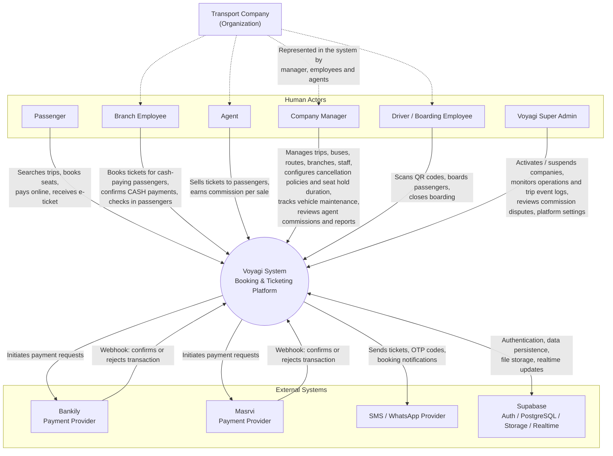

# 01 - System Context Diagram

## الشرح

مخطط السياق العام لنظام Voyagi. يوضح جميع الأطراف البشرية (المسافر، مدير الشركة، موظف الفرع، الوكيل، السائق/موظف الصعود، الأدمن المركزي) والأنظمة الخارجية (Bankily، Masrvi، مزود SMS/WhatsApp، Supabase) وكيفية تفاعل كل طرف مع نظام Voyagi. شركة النقل ممثلة ككيان تنظيمي يتعامل مع النظام عبر مديرها وموظفيها ووكلائها.

لم يُضف أي Actor جديد في هذه النسخة؛ فقط توسّع وصف تفاعل **Company Manager** (إدارة سياسات الإلغاء، إعداد مدة حجز المقعد، متابعة صيانة الحافلات، مراجعة عمولات الوكلاء) ووصف **Super Admin** (مراقبة سجلات أحداث الرحلات، مراجعة نزاعات العمولات).

## قرارات نهائية

- مدير الشركة يدير سياسات الإلغاء، مدة حجز المقعد، قنوات الإشعارات، Feature Flags، الصيانة وعمولات الوكلاء.
- لا يسمح أي Actor بحذف السجل المالي؛ الإلغاء والتسوية يتمان عبر حالات موثقة وAudit Log.
