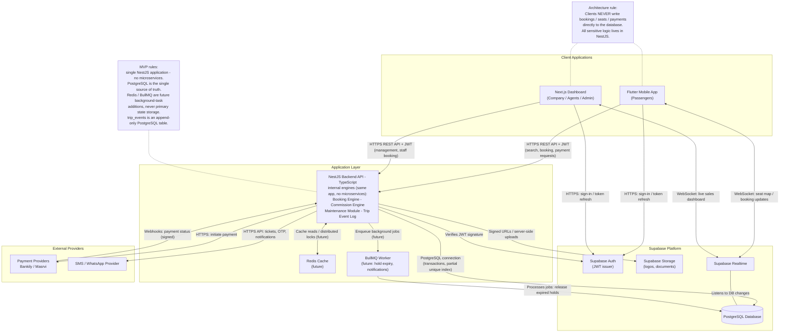

# 02 - Container Architecture Diagram

## الشرح

مخطط الحاويات (Containers) يوضح المكونات التقنية الرئيسية وبروتوكولات الاتصال بينها.

القاعدة المعمارية الأهم: تطبيق Flutter ولوحة Next.js **لا ينفذان منطق الحجز أو الدفع مباشرة على قاعدة البيانات**، بل يرسلان الطلبات إلى NestJS عبر HTTPS REST API مع JWT، وNestJS هو الوحيد الذي يفتح Transactions على PostgreSQL. استخدام Supabase من العملاء يقتصر على تسجيل الدخول (Auth) والاستماع للتحديثات (Realtime) وقراءة الملفات العامة (Storage).

داخل NestJS Backend API توجد المحركات الداخلية التالية (كلها Modules داخل نفس التطبيق):

- **Booking Engine**: الحجز والمقاعد والتذاكر.
- **Commission Engine**: عمولات الوكلاء (agent_commission_transactions).
- **Maintenance Module**: سجلات صيانة الحافلات.
- **Trip Event Log**: أحداث الرحلات كجدول Append-only في PostgreSQL.

قواعد المرحلة الأولى (MVP): **لا Microservices**، PostgreSQL هو **مصدر الحقيقة الوحيد**، وRedis وBullMQ إضافتان مستقبليتان للمهام الخلفية فقط — **ليسا مخزنًا للحالة الأساسية**.

## حدود المسؤولية النهائية

- PostgreSQL هو مصدر الحقيقة الوحيد للحجز والمقعد والدفع والعمولة.
- Redis/BullMQ لا يحتفظان بالحالة الأساسية؛ يستخدمان Cache والمهام القابلة لإعادة التنفيذ فقط.
- جميع عمليات NestJS تحمل `request_id` و`correlation_id` لتتبع الحجز والدفع والـWebhook.
- Feature Flags وإعدادات الشركة تُقرأ من `company_settings`، بينما القيم المؤثرة على حجز قائم تُحفظ Snapshot داخل الحجز.
