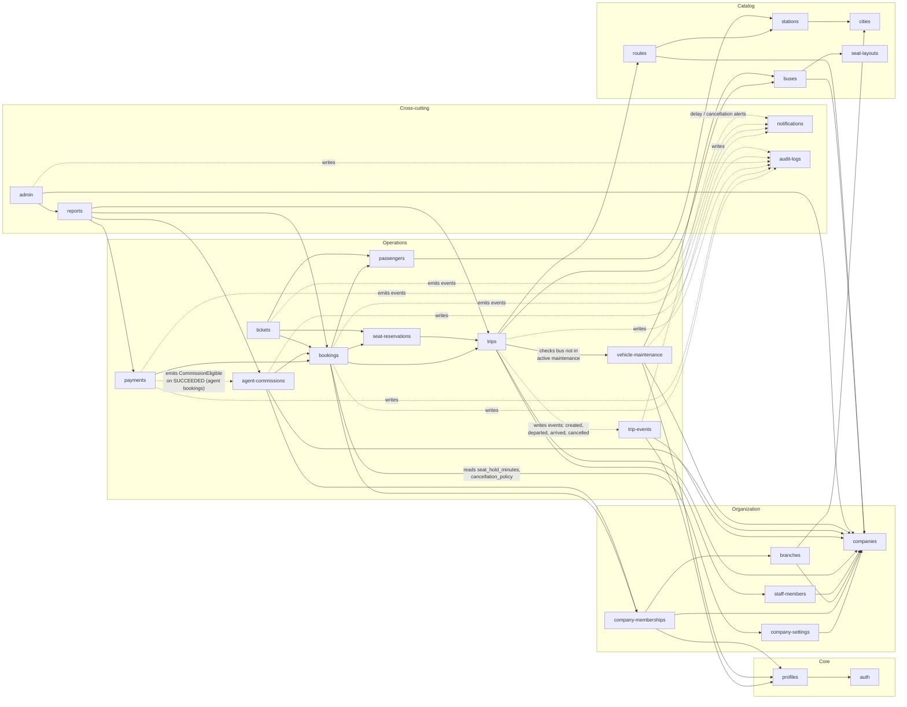

# 03 - Backend Modules Diagram (NestJS)

## الشرح

مخطط وحدات NestJS واعتمادياتها. السهم `A --> B` يعني أن الوحدة A **تعتمد على** الوحدة B (تستورد خدماتها).

الوحدات مقسمة إلى طبقات منطقية:

- **Core**: auth, profiles.
- **Organization**: companies, company-settings, company-memberships, branches, staff-members.
- **Catalog**: cities, stations, seat-layouts, buses, routes.
- **Operations**: trips, trip-events, bookings, passengers, seat-reservations, payments, tickets, agent-commissions, vehicle-maintenance.
- **Cross-cutting**: notifications, audit-logs, reports, admin.

`audit-logs` و`notifications` وحدتان مستعرضتان (Cross-cutting) تستدعيهما وحدات العمليات عند الحاجة.

الوحدات المضافة في هذه النسخة:

- **company-settings**: تعتمد على companies، وتقرأ منها bookings مدة حجز المقعد وسياسة الإلغاء.
- **agent-commissions**: وحدة **مستقلة** (وليست جزءًا من payments)؛ تعتمد على bookings وcompany-memberships وcompanies، وتستقبل حدث `CommissionEligible` من payments بعد نجاح الدفع لحجز بواسطة وكيل.
- **vehicle-maintenance**: تعتمد على buses وcompanies وprofiles، وتستشيرها trips للتحقق من أن الحافلة ليست في صيانة فعالة قبل جدولة رحلة.
- **trip-events**: سجل أحداث الرحلات؛ تكتب فيها trips الأحداث (إنشاء، انطلاق، وصول، إلغاء...) عبر أسهم متقطعة (Events) لتجنب الاعتماد الدائري، ويمكن لـ notifications الاستماع إليها لإرسال تنبيهات التأخير والإلغاء.

## وحدات داعمة نهائية

- `pricing-history`: يسجل تغييرات السعر الافتراضي للمسار دون تعديل أسعار الرحلات أو الحجوزات السابقة.
- `observability`: Middleware/Interceptor يولد `request_id` و`correlation_id` ويربطهما بـ`audit-logs`.
- جميع الحالات والأنواع المشتركة تُصدر من `packages/shared-types`، وتبقى قاعدة البيانات المرجع النهائي للقيود.
