# 04 - Database ER Diagram

## الشرح

هذا هو المخطط النهائي لقاعدة بيانات Voyagi على Supabase PostgreSQL. يوضح جميع الجداول الأساسية مع المفاتيح الأولية (PK) والمفاتيح الأجنبية (FK) والقيود الفريدة (UK)، بالإضافة إلى العلاقات بين الجداول.

ملاحظات مهمة:

- `profiles.id` يساوي `auth.users.id` في Supabase Auth (علاقة 1:1).
- الحماية النهائية من الحجز المزدوج هي **Partial Unique Index** على `seat_reservations (trip_id, seat_number)` عندما تكون الحالة `HELD` أو `CONFIRMED` أو `CHECKED_IN`.
- الحقول المُعلَّمة بـ `nullable` اختيارية.
- القيود المركبة (Composite Unique Constraints) مذكورة في قسم القيود أسفل المخطط لأن Mermaid لا يدعم تمثيلها بصريًا داخل الجدول.

جداول أُضيفت في هذه النسخة:

- **company_settings**: إعدادات كل شركة (مدة حجز المقعد، إغلاق الصعود، سياسة الإلغاء...) بعلاقة 1:1 مع `companies`. القيم **تُقرأ لحظة إنشاء الحجز أو الرحلة**، وتعديلها لاحقًا لا يغيّر الحجوزات القديمة بأثر رجعي.
- **agent_commission_transactions**: سجل محاسبي مستقل لكل عمولة وكيل (مستحقة أو مدفوعة). العمولة **لا تُسجل كدفعة نقدية في `payments`**، بل كقيد مالي مستقل هنا.
- **vehicle_maintenance_records**: سجلات صيانة الحافلات خارج جدول `buses`. عند وجود سجل صيانة فعال يمكن تحديث `buses.status` إلى `IN_MAINTENANCE` من NestJS داخل نفس الـ Transaction — **بدون Trigger معقد في الـ MVP**.
- **trip_events**: سجل أحداث الرحلة (Timeline) من نوع **Append-only Event Log**؛ تُضاف الأحداث فقط ولا تُعدَّل أو تُحذف الأحداث القديمة.
- **route_price_history**: سجل تاريخي لتغييرات السعر الافتراضي للمسار. سعر الرحلة والحجز يبقى Snapshot مستقلًا، لذلك لا يتغير السعر القديم عند تحديث السعر الافتراضي.

```mermaid
erDiagram
    auth_users ||--|| profiles : "profiles.id = auth.users.id"

    companies ||--o{ branches : "has"
    cities ||--o{ branches : "located in"
    companies ||--o{ company_memberships : "has members"
    profiles ||--o{ company_memberships : "belongs to"
    branches |o--o{ company_memberships : "optional branch scope"
    cities ||--o{ stations : "contains"
    companies ||--o{ buses : "owns"
    seat_layouts ||--o{ buses : "used by"
    companies ||--o{ staff_members : "employs"
    companies ||--o{ routes : "operates"
    stations ||--o{ routes : "origin"
    stations ||--o{ routes : "destination"
    companies ||--o{ trips : "runs"
    routes ||--o{ trips : "scheduled as"
    buses ||--o{ trips : "assigned to"
    staff_members |o--o{ trips : "driver (nullable)"
    staff_members |o--o{ trips : "assistant (nullable)"
    trips ||--o{ bookings : "booked on"
    companies ||--o{ bookings : "belongs to"
    branches |o--o{ bookings : "sold at (nullable)"
    profiles |o--o{ bookings : "booked_by (nullable)"
    bookings ||--o{ passengers : "includes"
    stations |o--o{ passengers : "boarding station (nullable)"
    trips ||--o{ seat_reservations : "seats of"
    bookings ||--o{ seat_reservations : "reserves"
    passengers |o--o| seat_reservations : "assigned seat (0..1)"
    bookings ||--o{ payments : "paid via"
    profiles |o--o{ payments : "confirmed_by (nullable)"
    bookings ||--o{ tickets : "issues"
    passengers ||--o| tickets : "ticket (0..1)"
    seat_reservations ||--o| tickets : "ticket (0..1)"
    profiles |o--o{ audit_logs : "actor (nullable)"
    companies |o--o{ audit_logs : "scope (nullable)"

    companies ||--|| company_settings : "settings (1:1)"
    company_memberships ||--o{ agent_commission_transactions : "agent earns"
    bookings ||--o{ agent_commission_transactions : "generates"
    companies ||--o{ agent_commission_transactions : "owes"
    buses ||--o{ vehicle_maintenance_records : "maintained by"
    companies ||--o{ vehicle_maintenance_records : "tracks"
    profiles |o--o{ vehicle_maintenance_records : "created_by (nullable)"
    trips ||--o{ trip_events : "timeline of"
    companies ||--o{ trip_events : "scope"
    profiles |o--o{ trip_events : "actor (nullable)"
    routes ||--o{ route_price_history : "price history"
    profiles |o--o{ route_price_history : "changed_by (nullable)"

    auth_users {
        uuid id PK "Supabase Auth"
    }

    profiles {
        uuid id PK "FK to auth.users.id"
        text full_name
        text phone_number
        boolean is_active
        timestamptz created_at
        timestamptz updated_at
    }

    companies {
        bigint id PK
        text name
        text logo_url
        text contact_phone
        boolean is_active
        timestamptz archived_at "nullable"
        timestamptz created_at
        timestamptz updated_at
    }

    branches {
        bigint id PK
        bigint company_id FK
        bigint city_id FK
        text name_ar
        text name_fr
        text phone
        boolean is_active
        timestamptz deleted_at "nullable"
        timestamptz created_at
        timestamptz updated_at
    }

    company_memberships {
        bigint id PK
        uuid user_id FK
        bigint company_id FK
        bigint branch_id FK "nullable"
        user_role_enum role
        numeric commission_rate
        boolean is_active
        timestamptz created_at
    }

    cities {
        bigint id PK
        text name_ar
        text name_fr
        boolean is_active
        timestamptz created_at
    }

    stations {
        bigint id PK
        bigint city_id FK
        text name_ar
        text name_fr
        numeric latitude
        numeric longitude
        boolean is_active
        timestamptz deleted_at "nullable"
        timestamptz created_at
        timestamptz updated_at
    }

    seat_layouts {
        bigint id PK
        text name
        int total_seats
        jsonb layout_grid
        timestamptz created_at
        timestamptz updated_at
    }

    buses {
        bigint id PK
        bigint company_id FK
        bigint seat_layout_id FK
        text plate_number
        text bus_model
        bus_status_enum status
        boolean is_active
        timestamptz deleted_at "nullable"
        timestamptz created_at
        timestamptz updated_at
    }

    staff_members {
        bigint id PK
        bigint company_id FK
        text full_name
        text phone
        staff_type_enum staff_type
        boolean is_active
        timestamptz deleted_at "nullable"
        timestamptz created_at
        timestamptz updated_at
    }

    routes {
        bigint id PK
        bigint company_id FK
        bigint origin_station_id FK
        bigint destination_station_id FK
        numeric default_price_mru
        int estimated_duration_minutes
        boolean is_active
        timestamptz deleted_at "nullable"
        timestamptz created_at
        timestamptz updated_at
    }

    trips {
        bigint id PK
        bigint company_id FK
        bigint route_id FK
        bigint bus_id FK
        bigint driver_id FK "nullable"
        bigint assistant_id FK "nullable"
        timestamptz departure_time
        timestamptz estimated_arrival_time
        numeric price_mru
        trip_status_enum status
        timestamptz boarding_closes_at
        boolean is_active
        timestamptz created_at
        timestamptz updated_at
    }

    bookings {
        uuid id PK
        text booking_reference UK
        bigint trip_id FK
        bigint company_id FK
        bigint branch_id FK "nullable"
        uuid booked_by_user_id FK "nullable"
        booking_channel_enum booking_channel
        booking_status_enum status
        numeric subtotal_amount
        numeric service_fee_amount
        numeric discount_amount
        numeric total_amount
        text currency
        timestamptz expires_at "nullable"
        text idempotency_key UK "nullable"
        timestamptz created_at
        timestamptz updated_at
    }

    passengers {
        bigint id PK
        uuid booking_id FK
        text full_name
        text phone
        text document_number "nullable"
        bigint boarding_station_id FK "nullable"
        timestamptz created_at
        timestamptz updated_at
    }

    seat_reservations {
        bigint id PK
        bigint trip_id FK
        uuid booking_id FK
        bigint passenger_id FK "nullable"
        varchar seat_number
        text status
        timestamptz held_until "nullable"
        timestamptz created_at
        timestamptz updated_at
    }

    payments {
        uuid id PK
        uuid booking_id FK
        payment_method_enum method
        payment_status_enum status
        numeric amount
        text currency
        text provider_reference "nullable"
        text internal_reference UK
        uuid confirmed_by_user_id FK "nullable"
        timestamptz paid_at "nullable"
        timestamptz created_at
        timestamptz updated_at
    }

    tickets {
        uuid id PK
        uuid booking_id FK
        bigint passenger_id FK
        bigint seat_reservation_id FK "UNIQUE"
        text ticket_number UK
        text qr_token_hash UK
        timestamptz issued_at
        timestamptz checked_in_at "nullable"
        timestamptz cancelled_at "nullable"
    }

    audit_logs {
        bigint id PK
        uuid actor_user_id FK "nullable"
        bigint company_id FK "nullable"
        text action
        text entity_type
        text entity_id
        jsonb old_values "nullable"
        jsonb new_values "nullable"
        text ip_address "nullable"
        text user_agent "nullable"
        uuid request_id "nullable"
        uuid correlation_id "nullable"
        timestamptz created_at
    }

    company_settings {
        bigint id PK
        bigint company_id FK "UNIQUE"
        int seat_hold_minutes "DEFAULT 10"
        int boarding_close_minutes "DEFAULT 30"
        char_3 currency "DEFAULT MRU"
        text timezone "DEFAULT Africa/Nouakchott"
        text default_language "DEFAULT ar"
        text support_phone "nullable"
        text support_whatsapp "nullable"
        text receipt_footer "nullable"
        text ticket_footer "nullable"
        boolean logo_print_enabled "DEFAULT TRUE"
        boolean sms_enabled "DEFAULT FALSE"
        boolean whatsapp_enabled "DEFAULT TRUE"
        boolean email_enabled "DEFAULT FALSE"
        boolean trip_delay_notification "DEFAULT TRUE"
        boolean payment_notification "DEFAULT TRUE"
        boolean allow_cash_payment "DEFAULT TRUE"
        boolean allow_online_payment "DEFAULT TRUE"
        jsonb cancellation_policy
        jsonb ticket_template_settings
        jsonb feature_flags
        timestamptz created_at
        timestamptz updated_at
    }

    agent_commission_transactions {
        uuid id PK
        bigint agent_membership_id FK
        uuid booking_id FK
        bigint company_id FK
        numeric_5_2 commission_rate
        numeric_12_2 base_amount
        numeric_12_2 commission_amount
        commission_status_enum status
        timestamptz earned_at
        timestamptz paid_at "nullable"
        timestamptz cancelled_at "nullable"
        timestamptz created_at
        timestamptz updated_at
    }

    vehicle_maintenance_records {
        bigint id PK
        bigint bus_id FK
        bigint company_id FK
        maintenance_type_enum maintenance_type
        text description "nullable"
        maintenance_status_enum status
        numeric_12_2 cost_mru "nullable"
        int odometer_km "nullable"
        timestamptz started_at
        timestamptz completed_at "nullable"
        timestamptz next_maintenance_at "nullable"
        uuid created_by_user_id FK "nullable"
        timestamptz created_at
        timestamptz updated_at
    }

    trip_events {
        bigint id PK
        bigint trip_id FK
        bigint company_id FK
        uuid actor_user_id FK "nullable"
        trip_event_type_enum event_type
        event_source_enum event_source
        timestamptz event_time
        jsonb metadata "nullable"
        timestamptz created_at
    }

    route_price_history {
        bigint id PK
        bigint route_id FK
        numeric price_mru
        timestamptz effective_from
        timestamptz effective_to "nullable"
        uuid changed_by_user_id FK "nullable"
        text change_reason "nullable"
        timestamptz created_at
    }
```




## التعدادات المعتمدة (PostgreSQL ENUMs)

تُنفذ هذه الحالات كتعدادات صريحة في PostgreSQL لمنع القيم غير الصحيحة، وتُشارك أسماؤها مع NestJS وواجهات العميل:

```text
user_role_enum: SUPER_ADMIN, COMPANY_MANAGER, BRANCH_EMPLOYEE, AGENT, PASSENGER
bus_status_enum: ACTIVE, IN_MAINTENANCE, OUT_OF_SERVICE, ARCHIVED
staff_type_enum: DRIVER, ASSISTANT
trip_status_enum: SCHEDULED, BOARDING, ONGOING, COMPLETED, CANCELLED
booking_channel_enum: MOBILE_APP, WEB, AGENT, BRANCH_OFFICE, ADMIN
booking_status_enum: DRAFT, HELD, PENDING_PAYMENT, CONFIRMED, PARTIALLY_CANCELLED, CANCELLED, COMPLETED, EXPIRED
seat_reservation_status_enum: HELD, CONFIRMED, CHECKED_IN, RELEASED, CANCELLED
payment_method_enum: CASH, BANKILY, MASRVI, SEDDAD, OTHER
payment_status_enum: PENDING, PROCESSING, SUCCEEDED, FAILED, CANCELLED, PARTIALLY_REFUNDED, REFUNDED
commission_status_enum: PENDING, EARNED, PAID, CANCELLED
maintenance_type_enum: OIL_CHANGE, GENERAL_SERVICE, BRAKE_SERVICE, ENGINE, INSPECTION, OTHER
maintenance_status_enum: SCHEDULED, IN_PROGRESS, COMPLETED, CANCELLED
trip_event_type_enum: TRIP_CREATED, BOARDING_OPENED, BOARDING_CLOSED, DEPARTED, DELAYED, ARRIVED, CANCELLED, BUS_CHANGED, DRIVER_CHANGED
trip_event_source_enum: SYSTEM, ADMIN, AGENT, EMPLOYEE, API
```

## القيود التي لا يظهرها Mermaid بصريًا

قيود فريدة مركبة (Composite Unique):

```sql
-- company_memberships
UNIQUE (user_id, company_id, branch_id, role);

-- buses
UNIQUE (company_id, plate_number);

-- routes
UNIQUE (company_id, origin_station_id, destination_station_id);

-- tickets
UNIQUE (booking_id, passenger_id);
```

قيد فحص (Check Constraint):

```sql
-- routes
CHECK (origin_station_id <> destination_station_id);
```

الفهرس الفريد الجزئي — الحماية النهائية من الحجز المزدوج:

```sql
CREATE UNIQUE INDEX uq_active_seat_per_trip
ON seat_reservations (trip_id, seat_number)
WHERE status IN ('HELD', 'CONFIRMED', 'CHECKED_IN');
```

قيد فريد جزئي على المدفوعات:

```sql
CREATE UNIQUE INDEX uq_payment_provider_ref
ON payments (method, provider_reference)
WHERE provider_reference IS NOT NULL;
```

قيود الجداول الجديدة:

```sql
-- company_settings (علاقة 1:1 مع companies)
ALTER TABLE company_settings
  ADD CONSTRAINT uq_company_settings_company UNIQUE (company_id),
  ADD CONSTRAINT ck_seat_hold_minutes CHECK (seat_hold_minutes > 0),
  ADD CONSTRAINT ck_boarding_close_minutes CHECK (boarding_close_minutes >= 0);

-- agent_commission_transactions
ALTER TABLE agent_commission_transactions
  ADD CONSTRAINT uq_commission_per_agent_booking
    UNIQUE (agent_membership_id, booking_id),
  ADD CONSTRAINT ck_commission_rate CHECK (commission_rate BETWEEN 0 AND 100),
  ADD CONSTRAINT ck_base_amount CHECK (base_amount >= 0),
  ADD CONSTRAINT ck_commission_amount CHECK (commission_amount >= 0);

-- vehicle_maintenance_records
ALTER TABLE vehicle_maintenance_records
  ADD CONSTRAINT ck_cost CHECK (cost_mru IS NULL OR cost_mru >= 0),
  ADD CONSTRAINT ck_odometer CHECK (odometer_km IS NULL OR odometer_km >= 0),
  ADD CONSTRAINT ck_completed_after_start
    CHECK (completed_at IS NULL OR completed_at >= started_at);
```

فهارس `trip_events`:

```sql
CREATE INDEX idx_trip_events_trip ON trip_events (trip_id, event_time DESC);
CREATE INDEX idx_trip_events_company ON trip_events (company_id, event_time DESC);
```

## ملاحظات سلوكية على الجداول الجديدة

- **company_settings**: يقرأ NestJS القيم (`seat_hold_minutes`, `boarding_close_minutes`, `cancellation_policy`...) لحظة إنشاء الحجز أو الرحلة، وتُثبَّت النتيجة في صف الحجز نفسه (`held_until`, `expires_at`). تعديل الإعدادات لاحقًا يسري على الحجوزات الجديدة فقط، **ولا يغيّر الحجوزات القديمة بأثر رجعي**.
- **agent_commission_transactions**: قيد `UNIQUE (agent_membership_id, booking_id)` يجعل إنشاء العمولة عملية Idempotent — لا يمكن تسجيل عمولتين لنفس الوكيل على نفس الحجز. العمولة سجل محاسبي مستقل، وليست صف دفع في `payments`.
- **vehicle_maintenance_records**: عند فتح سجل بحالة `SCHEDULED` أو `IN_PROGRESS` يحدّث NestJS حقل `buses.status` إلى `IN_MAINTENANCE` داخل نفس الـ Transaction، وعند `COMPLETED` أو `CANCELLED` يعيده. لا Trigger معقد في الـ MVP.
- **trip_events**: جدول Append-only؛ الكتابة `INSERT` فقط، ولا يوجد `UPDATE` أو `DELETE` على الأحداث القديمة (يمكن فرض ذلك بصلاحيات دور قاعدة البيانات). أنواع الأحداث: `TRIP_CREATED`, `BOARDING_OPENED`, `BOARDING_CLOSED`, `DEPARTED`, `DELAYED`, `ARRIVED`, `CANCELLED`, `BUS_CHANGED`, `DRIVER_CHANGED`.


## تحسينات دورة حياة البيانات

- لا تُحذف السجلات المالية والتشغيلية (`bookings`, `payments`, `tickets`, `agent_commission_transactions`, `trip_events`, `audit_logs`) حذفًا فعليًا.
- الجداول المرجعية القابلة للإيقاف تستخدم `is_active` و/أو `deleted_at`، مع إبقاء السجل لتوافق الحجوزات القديمة.
- `trips.price_mru` وحقول المبالغ داخل `bookings` تمثل Snapshot نهائيًا؛ تعديل `routes.default_price_mru` أو `route_price_history` لا يغيّر أي حجز سابق.
- `audit_logs.request_id` يحدد طلب HTTP الواحد، و`correlation_id` يربط العمليات الممتدة بين الحجز والدفع والـWebhook والإشعارات.
- `company_settings.feature_flags` يحتوي مفاتيح ميزات محدودة ومتحققًا منها على مستوى التطبيق، مثل `agent_sales` و`qr_boarding`؛ لا يُستخدم لتخزين حالات مالية أو تشغيلية.

فهارس إضافية موصى بها:

```sql
CREATE INDEX idx_audit_request_id ON audit_logs (request_id) WHERE request_id IS NOT NULL;
CREATE INDEX idx_audit_correlation_id ON audit_logs (correlation_id) WHERE correlation_id IS NOT NULL;
CREATE INDEX idx_route_price_history_effective
  ON route_price_history (route_id, effective_from DESC);
CREATE UNIQUE INDEX uq_route_open_price_period
  ON route_price_history (route_id)
  WHERE effective_to IS NULL;
```

## Production hardening addendum

Migration `20260717120000_013_production_hardening.sql` extends this frozen Phase 1 ERD without replacing existing fields:

- `routes`: `distance_km numeric(8,2) NOT NULL DEFAULT 0`, `currency char(3) NOT NULL DEFAULT 'MRU'`.
- `route_price_history`: `currency char(3) NOT NULL DEFAULT 'MRU'`.
- `buses`: `current_odometer_km integer NOT NULL DEFAULT 0`, `version integer NOT NULL DEFAULT 1`.
- `trips`: `currency char(3)`, nullable actual departure/arrival timestamps, and `version`.
- `bookings`: analytics-only `booking_source`, `ticket_price_snapshot numeric(12,2)`, and `version`; `booking_channel` remains unchanged.
- `agent_commission_transactions` and `vehicle_maintenance_records`: required three-letter currency snapshots.
- `audit_logs`: nullable `device_type`, `operating_system`, and `browser`.
- All application phone/contact columns use canonical validated international values.
- `tickets` continues to store only `qr_token_hash`; raw QR tokens are never persisted.

`booking_source_enum`: `APP`, `WEB`, `AGENT`, `ADMIN`, `API`.

`booking_event_type_enum`: `BOOKING_CREATED`, `PAYMENT_PENDING`, `PAYMENT_CONFIRMED`, `CHECKED_IN`, `BOARDING`, `CANCELLED`, `REFUND_CREATED`, `REFUND_COMPLETED`.

The append-only `booking_events` table contains a BIGINT identity key, tenant-safe `(booking_id, company_id)` foreign key, optional actor, typed event, event timestamp, optional JSON object metadata, and creation timestamp. RLS follows access to the parent booking.
