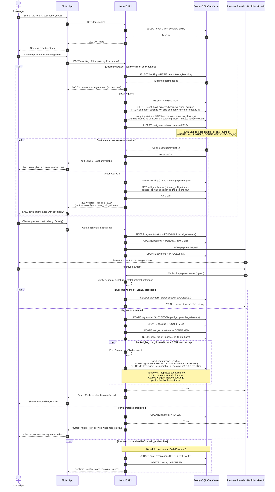

# 05 - Passenger Booking Sequence Diagram

## الشرح

تسلسل عملية الحجز الكاملة من تطبيق المسافر (Flutter): البحث، حجز المقعد بحالة HELD داخل Transaction محمية بالـ Partial Unique Index، ثم الدفع عبر مزود خارجي وتأكيد الحجز وإصدار التذكرة عبر Webhook.

ملاحظتان في هذه النسخة:

- مدة حجز المقعد **ليست Hardcoded**؛ يقرأ NestJS قيمة `company_settings.seat_hold_minutes` (وكذلك `boarding_close_minutes` عند التحقق من إغلاق الحجز) ويثبّتها في `held_until` و`expires_at` لحظة إنشاء الحجز.
- بعد نجاح الدفع، إذا كان `booked_by_user_id` مرتبطًا بعضوية `AGENT`، يُطلق النظام حدث `CommissionEligible` وتنشئ وحدة agent-commissions سجل العمولة بشكل Idempotent. هذا المسار لا ينطبق غالبًا على المسافر المباشر، لكنه يدعم الحجوزات التي **يبدأها وكيل ثم يكمل العميل دفعها إلكترونيًا**.

الحالات البديلة المغطاة:

1. المقعد محجوز مسبقًا → رد 409 Conflict.
2. الضغط المزدوج على زر الحجز → نفس الحجز يُعاد عبر Idempotency Key.
3. Webhook مكرر → معالجة Idempotent بلا تغيير.
4. فشل الدفع → تحديث الحالة والسماح بإعادة المحاولة ما دام الحجز ساريًا.
5. انتهاء المهلة قبل الدفع → تحرير المقعد وانتهاء الحجز.

## ملاحظات نهائية على الاتساق

- يحمل طلب الحجز `Idempotency-Key` و`X-Correlation-Id`.
- سعر الرحلة المنسوخ إلى الحجز هو Snapshot ولا يتغير عند تعديل السعر الافتراضي للمسار لاحقًا.
- إعدادات الشركة تُقرأ قبل إنشاء الحجز، ثم تُثبت النتائج (`held_until`, الرسوم، العملة) في الحجز نفسه.
