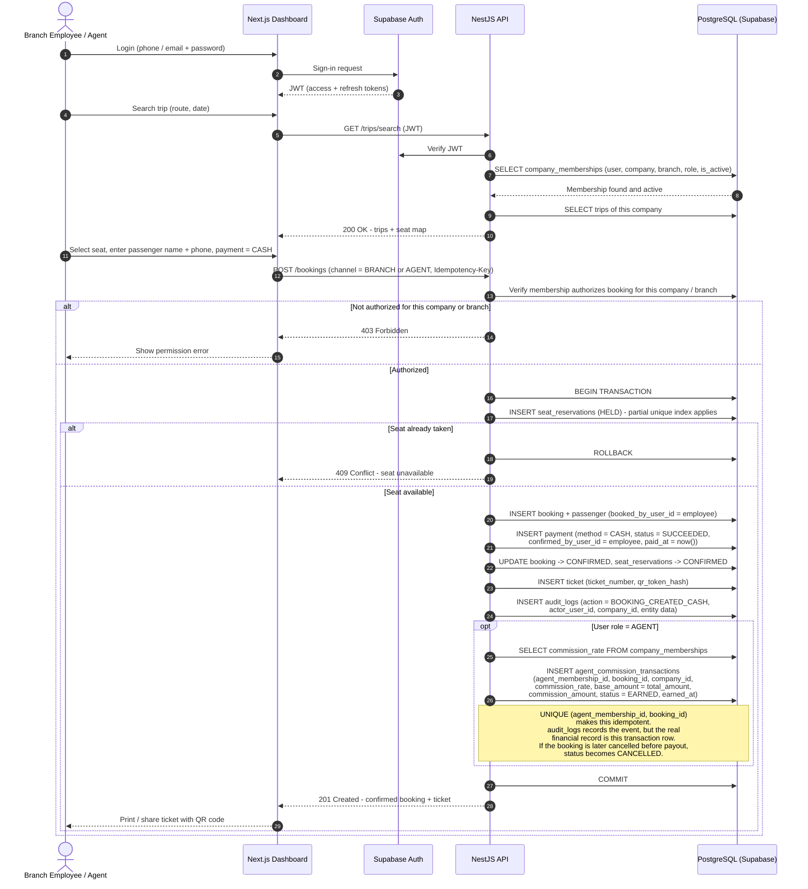

# 06 - Agent / Branch Employee Booking Sequence Diagram

## الشرح

تسلسل حجز تذكرة من موظف فرع أو وكيل عبر لوحة Next.js، لمسافر يدفع نقدًا (CASH). يتحقق NestJS من صلاحيات الموظف عبر `company_memberships` (الشركة والفرع والدور)، ثم ينشئ الحجز ويؤكد الدفع النقدي فورًا ويصدر التذكرة ويسجل العملية في `audit_logs`.

إذا كان المستخدم وكيلًا (Agent):

1. يجلب NestJS قيمة `commission_rate` من `company_memberships`.
2. ينشئ صفًا في **`agent_commission_transactions`** بحالة `EARNED` لأن الحجز مؤكد.
3. `audit_logs` يسجل الحدث فقط؛ **السجل المالي الحقيقي هو صف `agent_commission_transactions`** وليس سطر التدقيق.
4. إذا أُلغي الحجز لاحقًا قبل دفع العمولة، تتحول العمولة إلى `CANCELLED` (انظر مخطط حالات الحجز).

## ملاحظات نهائية على العمولة

- إنشاء العمولة Idempotent بالقيد `(agent_membership_id, booking_id)`.
- إذا أصبحت العمولة `PAID` ثم أُلغي الحجز، لا يُحذف السجل ولا يُعاد إلى `CANCELLED`؛ تنشأ تسوية مالية مستقلة ويُحفظ الأثر في Audit Log.
- كل العملية تشترك في `correlation_id` واحد.
