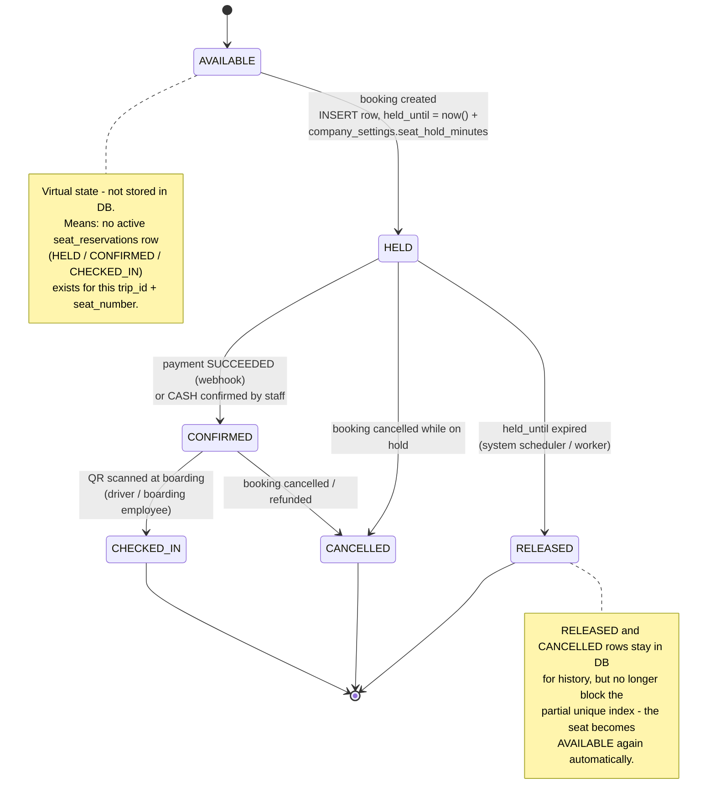

# 07 - Seat Reservation State Diagram

## الشرح

آلة الحالة لمقعد داخل رحلة معينة.

نقطة جوهرية: **AVAILABLE ليست قيمة مخزنة في العمود `status`**، بل هي حالة افتراضية (Virtual State) تعني عدم وجود صف نشط في `seat_reservations` لهذا المقعد في هذه الرحلة بحالة `HELD` أو `CONFIRMED` أو `CHECKED_IN`. الفهرس الفريد الجزئي على `(trip_id, seat_number)` هو ما يضمن أن مقعدًا واحدًا لا يملك أكثر من صف نشط واحد في أي لحظة.

الحالات لم تتغير في هذه النسخة؛ فقط أصبحت مدة الحجز المؤقت **ديناميكية** تُقرأ من `company_settings.seat_hold_minutes` بدل قيمة ثابتة (10 دقائق).

## قاعدة نهائية

الحالة الافتراضية `AVAILABLE` تُحسب من غياب صف نشط، ولا تُحفظ في قاعدة البيانات. تحرير المقعد يتم بتغيير حالة الصف إلى `RELEASED` أو `CANCELLED`، وليس بحذفه.
