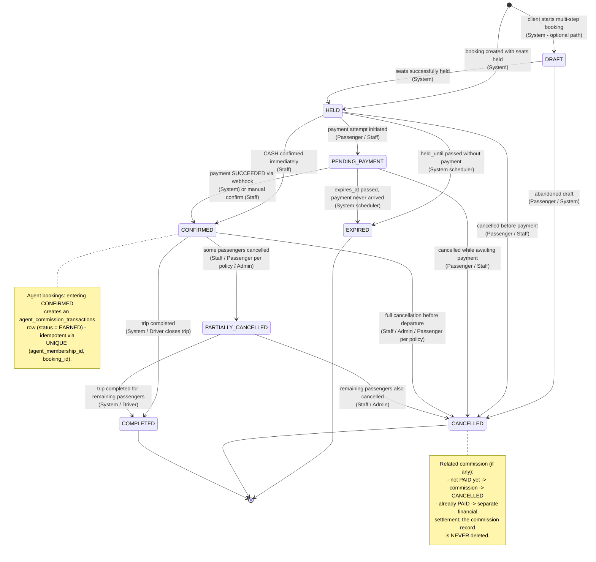

# 08 - Booking State Diagram

## الشرح

آلة الحالة للحجز (`bookings.status`) مع توضيح الجهة المخوّلة بتنفيذ كل انتقال:

- **System**: انتقالات آلية ينفذها NestJS أو الـ Scheduler.
- **Passenger**: عبر تطبيق Flutter.
- **Staff**: موظف الفرع أو الوكيل أو مدير الشركة عبر اللوحة.
- **Admin**: أدمن منصة Voyagi (تدخل استثنائي).

ملاحظة: `DRAFT` اختيارية وتُستخدم فقط إذا سمحنا للعميل ببناء الحجز على مراحل قبل تثبيت المقاعد؛ المسار المباشر يبدأ من `HELD`.

آثار جانبية متعلقة بالعمولات:

- عند الانتقال إلى `CONFIRMED` لحجز بواسطة وكيل، يُنشأ صف في `agent_commission_transactions` (بشكل Idempotent).
- عند الانتقال إلى `CANCELLED`، تُلغى العمولة المرتبطة إذا لم تكن `PAID`.
- إذا كانت العمولة `PAID` بالفعل، فالإلغاء يتطلب **تسوية مالية منفصلة**، ولا يُحذف سجل العمولة أبدًا.

## قاعدة نهائية لدورة الحياة

لا تُعاد الحجوزات من حالة نهائية إلى حالة سابقة. أي تصحيح مالي بعد `COMPLETED` أو بعد دفع عمولة ينفذ كسجل تسوية جديد، مع المحافظة على الحجز الأصلي وسجل التدقيق.
