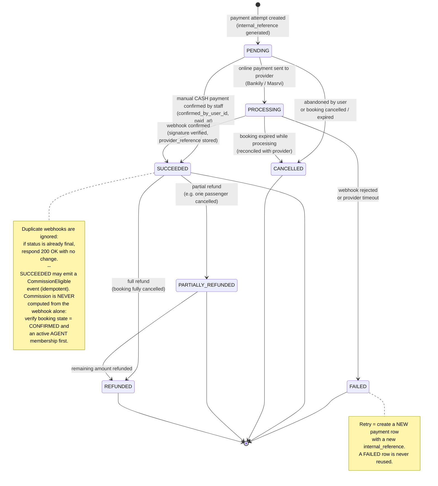

# 09 - Payment State Diagram

## الشرح

آلة الحالة لمحاولة الدفع (`payments.status`).

قواعد مهمة:

- **الدفع اليدوي (CASH)**: ينتقل مباشرة من `PENDING` إلى `SUCCEEDED` بتأكيد الموظف (`confirmed_by_user_id`).
- **الدفع الإلكتروني**: `PENDING → PROCESSING` عند الإرسال للمزود، ثم `SUCCEEDED` أو `FAILED` حسب الـ Webhook بعد التحقق من التوقيع.
- **إعادة المحاولة**: صف الدفع الفاشل لا يُعاد استخدامه؛ كل محاولة جديدة تُنشئ صف `payment` جديدًا بـ `internal_reference` جديد (لهذا العلاقة Booking 1:N Payments).
- **Webhook المكرر**: يُتجاهل إذا كانت الحالة نهائية بالفعل (معالجة Idempotent عبر القيد الفريد الجزئي على `method + provider_reference`).
- **الاسترجاع**: من `SUCCEEDED` إلى `PARTIALLY_REFUNDED` (استرجاع جزئي، مثل إلغاء راكب واحد) أو `REFUNDED` (استرجاع كامل).
- **حدث العمولة**: انتقال الدفع إلى `SUCCEEDED` قد يطلق حدث `CommissionEligible` نحو وحدة agent-commissions. الحدث **Idempotent** (القيد الفريد على `agent_membership_id + booking_id` يمنع التكرار)، و**لا تُحسب العمولة اعتمادًا على الـ Webhook وحده** — يجب التحقق أولًا من حالة الحجز (`CONFIRMED`) ومن وجود عضوية `AGENT` نشطة مرتبطة بـ `booked_by_user_id`.

## قاعدة نهائية للدفع

كل محاولة دفع صف مستقل، ولا يُعاد استخدام محاولة `FAILED`. جميع Webhooks تُعالج Idempotently، ويُربط `provider_reference` و`internal_reference` و`correlation_id` لتسهيل المطابقة والتحقيق.
