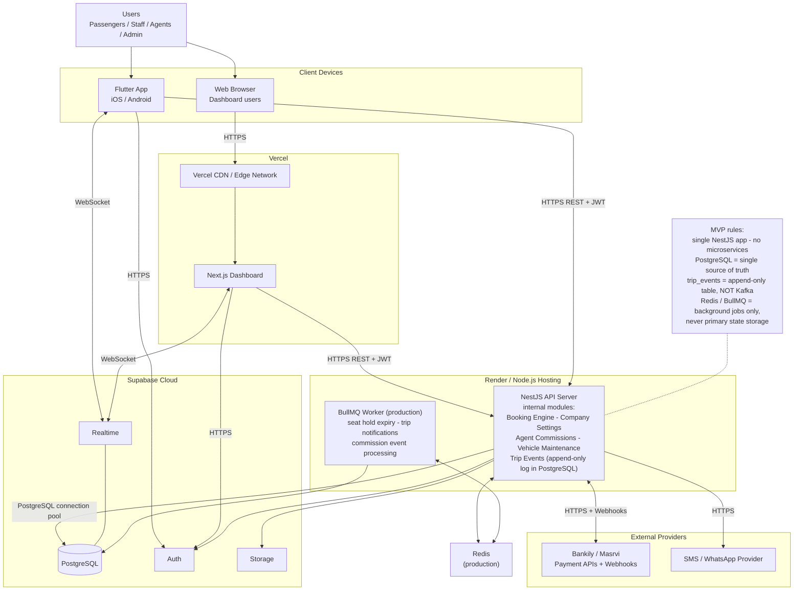

# 10 - Deployment Diagram

## الشرح

مخطط النشر يوضح مسار الطلبات من المستخدمين إلى البنية التحتية: أجهزة العملاء → Vercel (اللوحة) وRender (خادم NestJS) → منصة Supabase → مزودي الدفع والرسائل الخارجيين.

الوحدات الجديدة (Company Settings, Agent Commissions, Vehicle Maintenance, Trip Events) **لا تتطلب خدمات مستقلة**؛ هي NestJS Modules داخل نفس الـ API. لا Microservices في الـ MVP، وPostgreSQL يظل **المصدر الوحيد للحقيقة**، و`trip_events` جدول Append-only في PostgreSQL — **ليس Kafka ولا Event Store خارجيًا**.

## بيئتا التشغيل

```mermaid
flowchart LR
    subgraph DEV["Development Environment"]
        D1["Supabase Free tier"]
        D2["Render Free<br/>(NestJS - sleeps when idle)"]
        D3["Vercel Free<br/>(Next.js previews)"]
        D4["No Redis / No worker"]
        D5["Test payment sandbox"]
    end

    subgraph PROD["Production Environment"]
        P1["Supabase Pro<br/>+ Automated Backups (PITR)"]
        P2["Always-on NestJS server<br/>(paid Render / Node.js host)"]
        P3["Vercel production<br/>+ custom domain"]
        P4["Redis cache + BullMQ worker:<br/>seat hold expiry, trip notifications,<br/>commission event processing"]
        P5["Monitoring & alerting<br/>logs, uptime, error tracking"]
        P6["Live payment providers<br/>signed webhooks"]
    end

    DEV -->|"promote via CI/CD<br/>GitHub Actions on monorepo"| PROD
```

## المراقبة المطلوبة قبل الإنتاج

- Structured logs تشمل `request_id`, `correlation_id`, `booking_reference`, و`payment internal_reference` دون تسريب بيانات حساسة.
- تنبيهات على فشل Webhooks، تراكم مهام انتهاء الحجز، وارتفاع تعارضات المقاعد.
- النسخ الاحتياطية لا تغني عن اختبار الاستعادة دوريًا.
