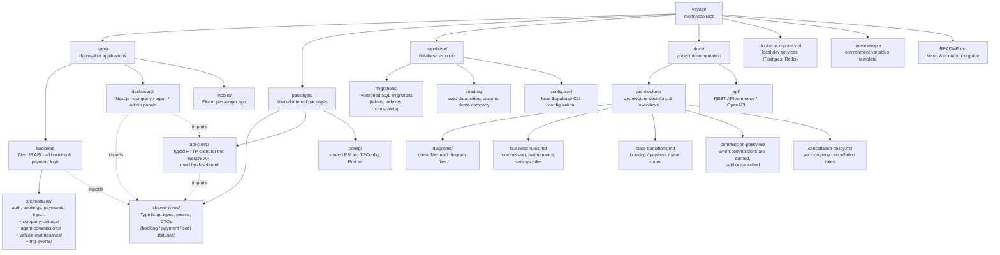

# 11 - Monorepo Structure Diagram

## الشرح

هيكل الـ Monorepo على GitHub. التطبيقات الثلاثة تعيش في `apps/`، والكود المشترك في `packages/` (أهمها `shared-types` الذي يضمن توحيد الأنواع والـ Enums مثل حالات الحجز والدفع بين Backend وDashboard وMobile)، وكل ما يخص قاعدة البيانات (Migrations) في `supabase/`، والتوثيق في `docs/`.

البنية الأساسية لم تتغير؛ أُضيف فقط توضيح لمجلد `src/modules/` داخل `apps/backend` (ويشمل الوحدات الجديدة company-settings وagent-commissions وvehicle-maintenance وtrip-events)، وأربعة ملفات توثيق جديدة داخل `docs/architecture/`.

## إضافات التوثيق والكود المشترك

- `packages/shared-types`: جميع Enums والعقود المشتركة.
- `apps/backend/src/modules/pricing-history`: سجل تغير الأسعار.
- `apps/backend/src/common/observability`: request/correlation IDs وstructured logging.
- `docs/architecture/data-lifecycle.md`: سياسات الحذف الناعم والاحتفاظ بالسجلات.
