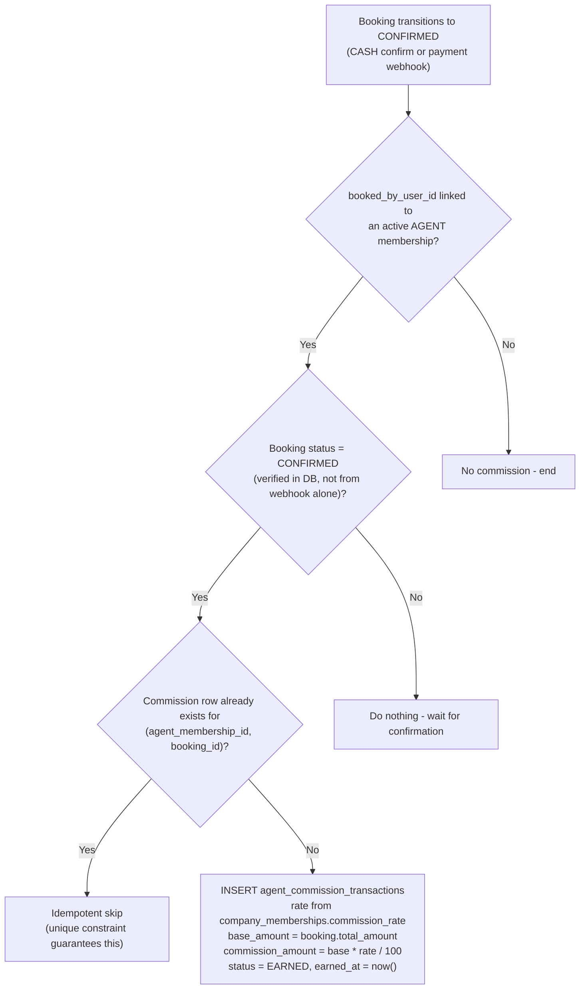
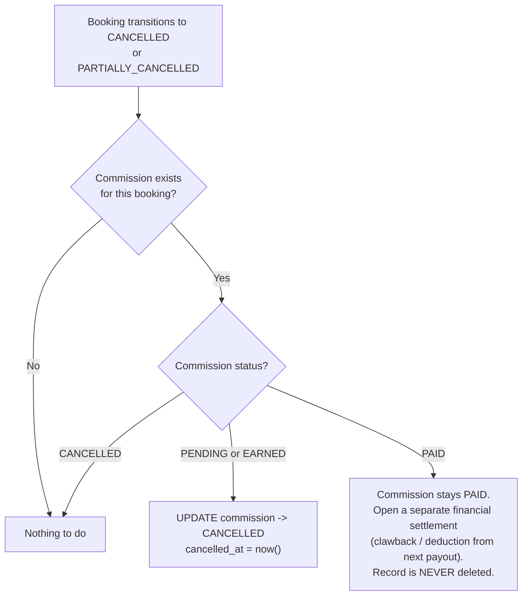
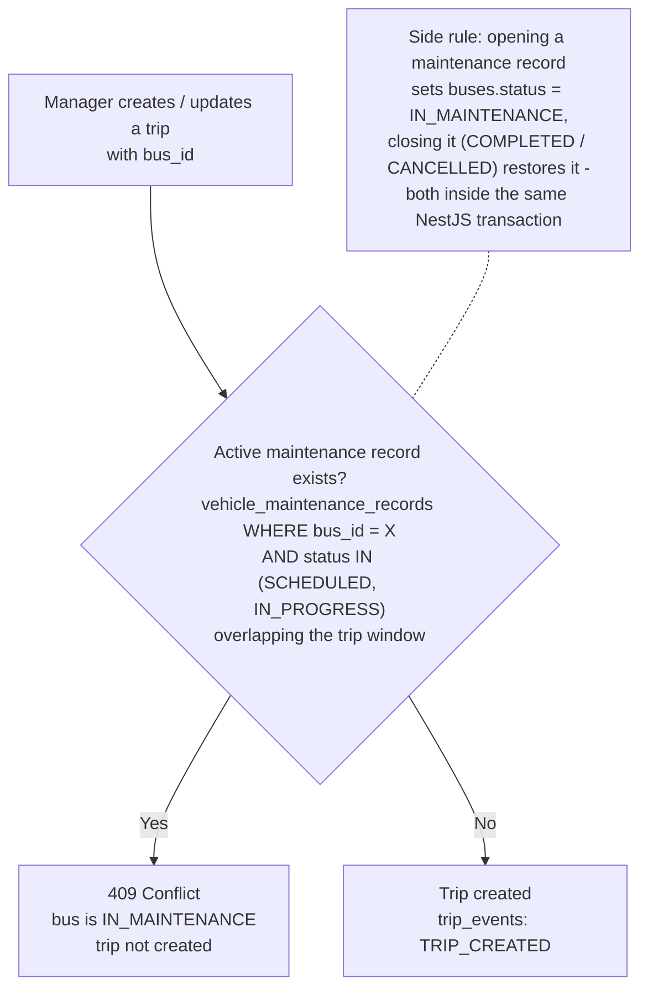
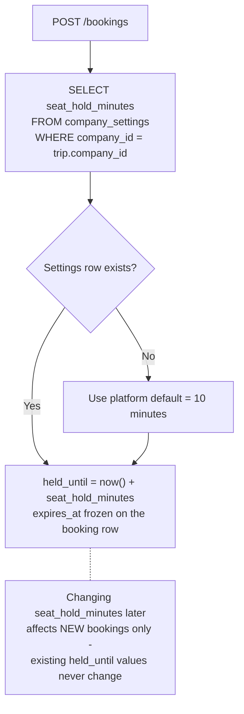
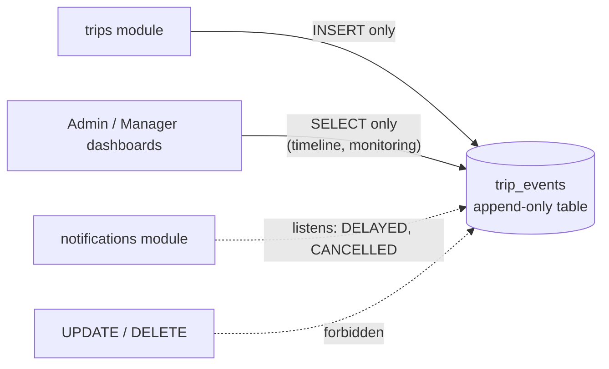
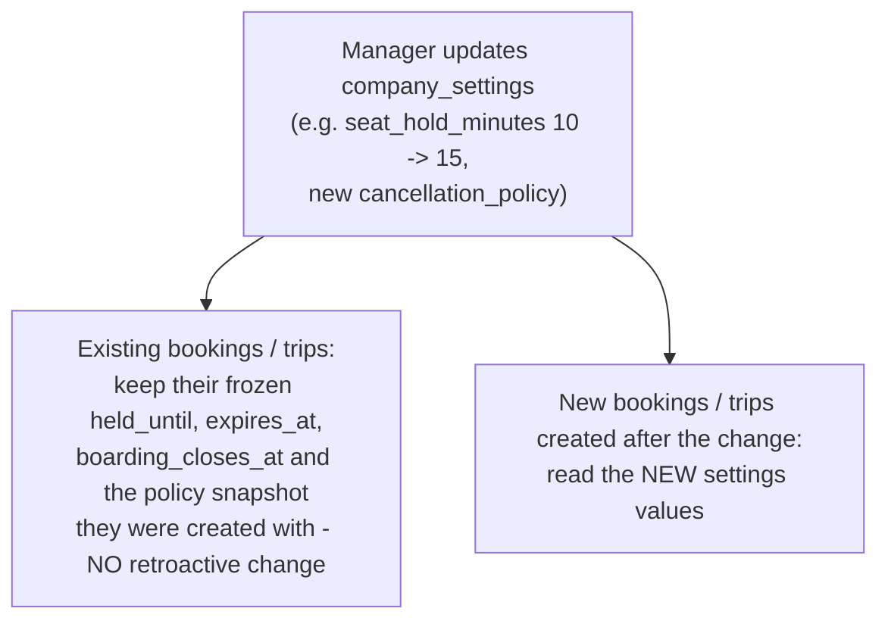

# 12 - Business Rules

## الشرح

هذا الملف يوثق القواعد التجارية (Business Rules) الحاكمة للوحدات الجديدة: عمولات الوكلاء، صيانة الحافلات، إعدادات الشركة، وسجل أحداث الرحلات. كل قاعدة موضحة بمخطط Mermaid أو جدول، وجميعها تُنفَّذ في NestJS داخل Transactions، مع قيود PostgreSQL كخط الدفاع النهائي.

---

## 1. سياسة إنشاء عمولة الوكيل

العمولة تُنشأ فقط عندما يتأكد الحجز، وبشكل Idempotent عبر القيد `UNIQUE (agent_membership_id, booking_id)`. لا تُحسب اعتمادًا على Webhook الدفع وحده.

---

## 2. سياسة إلغاء العمولة

عند إلغاء الحجز، مصير العمولة يعتمد على حالتها. السجل المالي **لا يُحذف أبدًا**.

| حالة العمولة عند إلغاء الحجز | الإجراء |
|---|---|
| PENDING / EARNED | تتحول إلى CANCELLED |
| PAID | تبقى PAID + تسوية مالية منفصلة، لا حذف |
| CANCELLED | لا شيء (Idempotent) |

---

## 3. سياسة منع حجز حافلة في الصيانة

`trips` تستشير `vehicle-maintenance` قبل جدولة الرحلة. تحديث `buses.status` يتم من NestJS داخل نفس الـ Transaction — بدون Trigger معقد في الـ MVP.

---

## 4. سياسة مدة حجز المقعد حسب إعدادات الشركة

المدة تُقرأ من `company_settings.seat_hold_minutes` لحظة إنشاء الحجز وتُثبَّت في صف الحجز نفسه.

---

## 5. سياسة عدم قابلية trip_events للتعديل

`trip_events` هو Append-only Event Log: الكتابة `INSERT` فقط.

| القاعدة | التنفيذ |
|---|---|
| لا UPDATE ولا DELETE على الأحداث | لا يوفر NestJS أي Endpoint للتعديل أو الحذف؛ ويمكن سحب صلاحيتي UPDATE/DELETE من دور قاعدة البيانات على هذا الجدول |
| تصحيح حدث خاطئ | يُسجَّل حدث جديد معاكس أو تصحيحي (مثل `DELAYED` ثم `DEPARTED`) مع `metadata` توضيحية |
| الترتيب الزمني | يُقرأ عبر الفهرس `(trip_id, event_time DESC)` |
| ليس Event Store خارجيًا | جدول PostgreSQL عادي — ليس Kafka ولا نظام رسائل في الـ MVP |

---

## 6. سياسة عدم التأثير الرجعي لتعديلات company_settings

| اللحظة | القيمة المستخدمة |
|---|---|
| إنشاء الحجز | `seat_hold_minutes` و`cancellation_policy` الحاليتان تُقرآن وتُثبَّتان في صف الحجز |
| إنشاء الرحلة | `boarding_close_minutes` الحالية تُستخدم لحساب `boarding_closes_at` وتُثبَّت في صف الرحلة |
| تعديل الإعدادات لاحقًا | يسري على السجلات الجديدة فقط؛ الحجوزات المؤكدة والرحلات القائمة لا تتغير بأثر رجعي |

## 7. سياسة الأسعار التاريخية

- `routes.default_price_mru` هو السعر الافتراضي الحالي فقط.
- كل تغيير يسجل في `route_price_history`.
- عند إنشاء `trip` ينسخ السعر إلى `trips.price_mru`.
- عند إنشاء الحجز تنسخ المبالغ النهائية إلى `bookings`; لا يؤثر أي تعديل لاحق بأثر رجعي.

## 8. سياسة التتبع والحذف

- كل عملية حساسة تحمل `request_id` و`correlation_id`.
- لا حذف فعلي للحجوزات والمدفوعات والتذاكر والعمولات والأحداث والتدقيق.
- الجداول المرجعية تُعطّل بـ`is_active` أو `deleted_at`.
